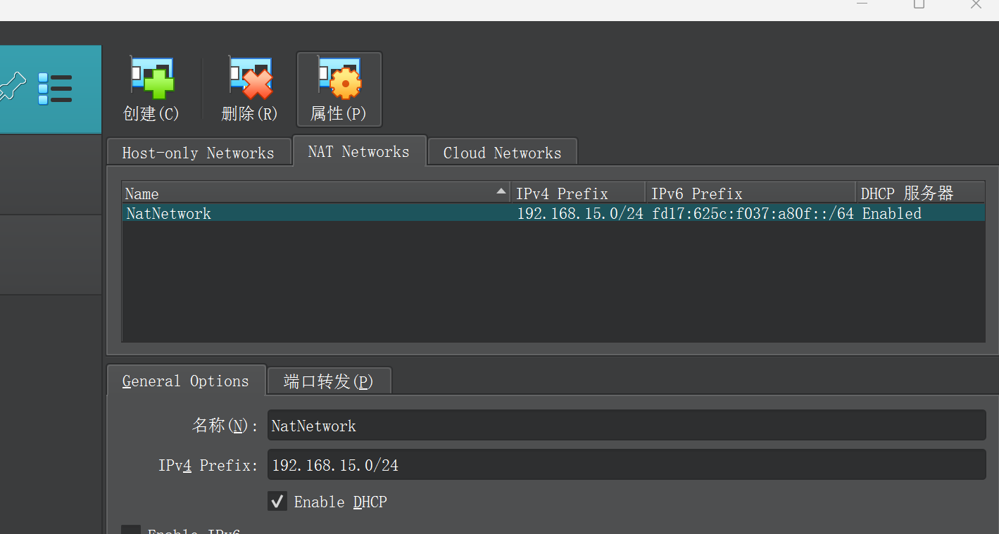

# 准备ubuntu环境

## 安装VirtualBox

从VirtualBox官网下载VirtualBox，VirtualBox是开源虚拟机，不收钱

https://www.virtualbox.org/wiki/Downloads

## 下载ubuntu镜像

ubuntu在所有linux distro里有最好的开箱易用性

https://ubuntu.com/download/server#downloads

我们选择下载ubuntu 22.04 LTS

## 配置NAT网络

我们需要将虚拟机运行在子网环境，在这里我们配置192.168.15.0/24的子网

## 安装虚拟机

## 关闭swap分区
